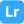
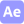

    <h1>Hi, I'm azuki! ⪥</h1>
    
A magic that makes everything simple.

    

## Links 💨

    

## Environment 💭

    
    
    
    

## Favorites 🤍

    
    
    
    
    
    

## Skills ☕

    
    
    
    
    
    
    
    
    
    
    

## Stats 🤔

